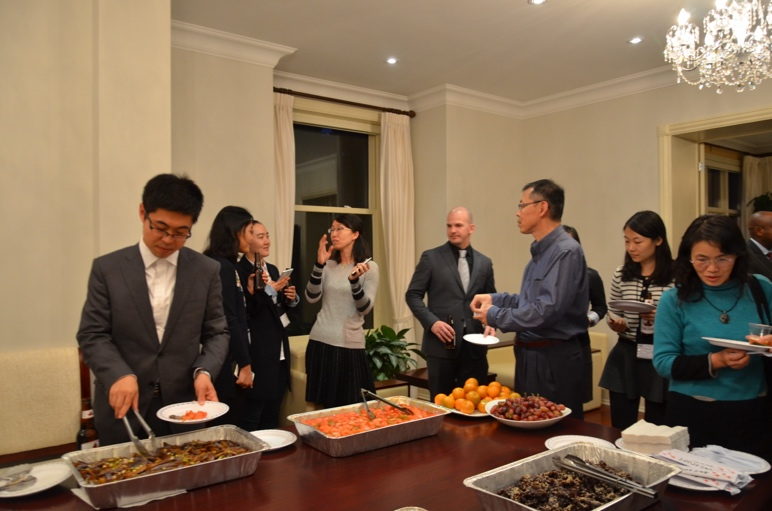
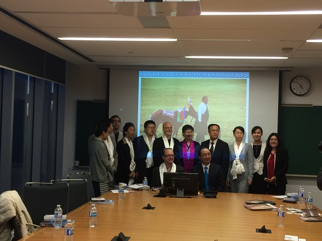
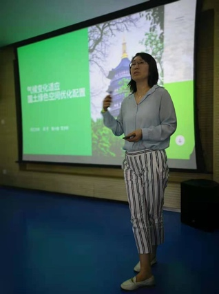
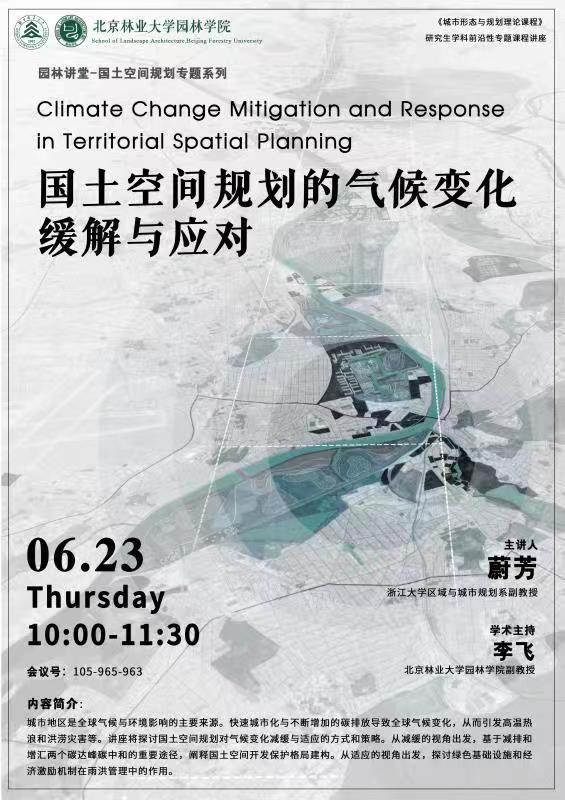
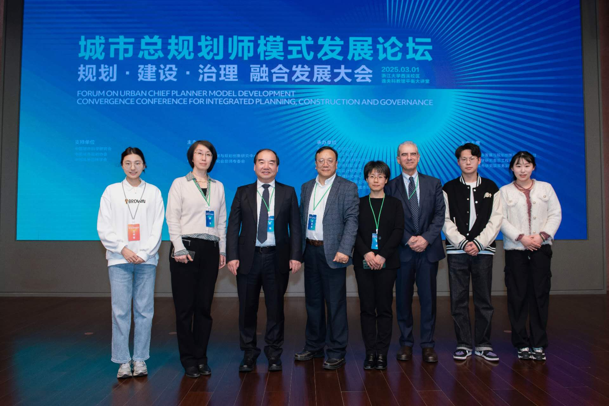
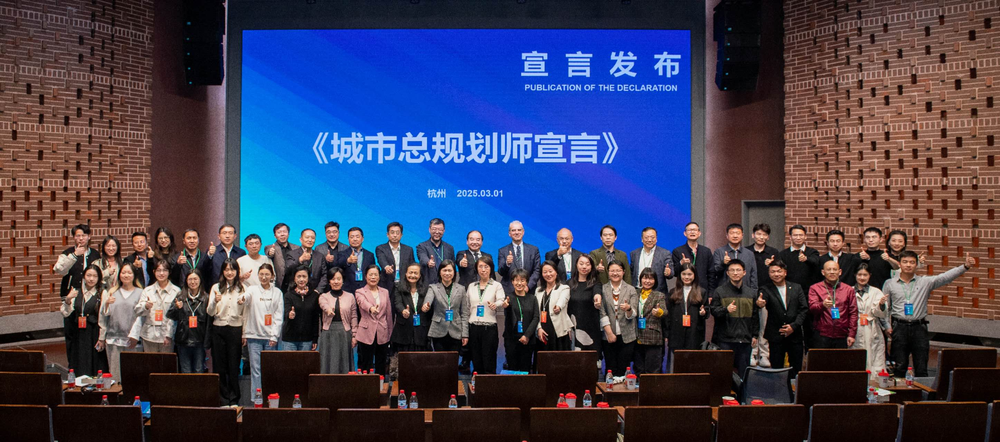
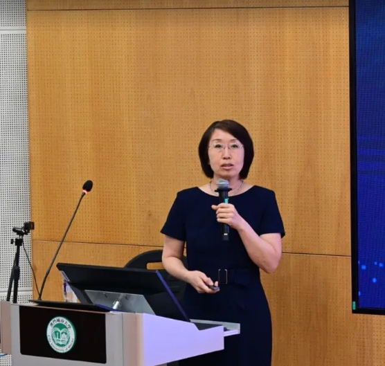

中国一加拿大---非洲可持续城市化国际研讨会（ICCCASU）
====================================================

First International Conference on Canadian, Chinese and African
Sustainable Urbanization, ICCCASU1

会议时间地点：24th -25th October 2015，University of Ottawa, Canada

2015年10月24-25，加拿大渥太华

加拿大---中国---非洲可持续发展国际会议（ICCCASU）是一个围绕可持续城市发展议题开展交流与合作的国际智库平台。会议重点关注加拿大、中国和非洲三个区域，成员涵盖政治人物、决策者、学者及相关行业从业者。ICCCASU
旨在通过系列会议与研讨活动，分享可持续城市化进程中的研究成果与最佳实践。该会议由联合国人居署（UN-Habitat）与渥太华大学（University
of Ottawa）于 2014 年共同倡议并创立。

{width="2.647222222222222in"
height="1.9125in"}ICCCASU 第一届会议（ICCCASU I）于 2015
年在加拿大渥太华召开，吸引了 200
余名来自相关领域的参会者。浙江大学蔚芳在本届会议中担任分论坛主持，并作题为《城市开放空间的空间不平等------中国城市化的现实与挑战》（Spatial
Inequity of Urban Open Spaces -- Reality and Challenges of China's
Urbanization）的专题报告。

{width="2.798611111111111in"
height="1.8659722222222221in"}

会议现场 浙江大学蔚芳担任会议论坛主持

中国驻加拿大大使馆教育处晚宴
============================

2015年10月25日，由联合国人居署和渥太华大学联合主办的"2015加拿大及国际视野下的中国和非洲可持续城市化"国际会议（ICCASU
2015）圆满落幕。会后，浙江大学蔚芳与来自国内外高校的近30位城市规划专家、学者及跨学科研究人员受邀参加由中国驻加拿大使馆教育处举办的晚宴。晚宴由中国驻加拿大大使馆教育处公参杨新育女士主持。

在轻松融洽的交流氛围中，与会学者围绕本次会议的核心议题进行了深入研讨，继续就中非可持续城市化相关问题交换观点、碰撞思想。参会专家在互动中分享了各自的研究成果与见解，提出了多项关于推动中非可持续城市化发展的新思路、新视角，为未来的城市化建设合作注入了新的启示与动力。

{width="3.4871423884514434in"
height="2.3098589238845144in"}{width="1.8659722222222221in"
height="2.323611111111111in"}

大使馆教育处晚宴合影

**与中国西藏历史与文化专家代表团专题交流会**
============================================

Meeting/discussion/exchange with the delegation of Chinese experts and
specialists on Tibetan History and Culture

2015年11月17日，中国西藏历史与文化专家代表团访问渥太华大学。代表团由长期从事西藏历史、文化、宗教及民族学研究的学者组成。会议旨在通过面对面交流，增进中加双方对西藏历史与文化的理解，推动相关学科的合作与知识共享。来自中国、加拿大及非洲的专家学者出席了会议。

会议期间，双方就西藏的历史演变、文化传统、社会发展及当代研究热点进行了深入讨论。中国代表团围绕西藏改革开放成就、非物质文化遗产保护、新兴文化现象及国家政策支持等主题作专题介绍，包括教育、医疗、基础设施建设、民族文化传承及文化变迁等内容。加方学者则从宗教传播、生态保护、语言教学、区域发展及社会稳定等角度提出问题并展开讨论。渥太华大学访问学者、浙江大学蔚芳教授与中方专家就西藏现代居民房屋建筑及传统住房特色进行了探讨。

在热烈而开放的氛围中，双方就西藏现代化进程中的文化保护、生态平衡、社会政策及多学科合作进行了富有成果的交流。本次会面不仅加深了中加学者对西藏的理解，也为未来在文化、教育及可持续发展领域的合作奠定了坚实基础。与会学者还积极探讨了未来合作方向、学术资源共享及联合研究项目的可能性，为中加在西藏研究领域搭建了重要的学术交流平台。

> {width="4.682638888888889in"
> height="2.8876760717410326in"}
>
> 与会主要代表佩戴代表团赠送的哈达

中国驻加拿大使馆春节招待会
==========================

（2017年1月下旬）浙江大学蔚芳副教授应邀参加中国驻加拿大使馆在渥太华隆重举办的丁酉鸡年新春招待会，这也是加拿大联邦政府正式将农历正月初一至十五定为
"春节" 后的首个官方新春庆典。招待会以 "团圆守岁・共话友邦"
为主题，汇聚加拿大三级政府政要、中加议会协会代表、华侨华人领袖、中资机构及留学生代表等数百人，在张灯结彩的喜庆氛围中，共庆新春佳节，共叙双边情谊。​中国驻加拿大使馆临时代办王文天致辞，加拿大政要代表在致辞中纷纷向华侨华人送上新春祝福。招待会现场洋溢着浓郁的中国年味。此次新春招待会不仅是一场团圆庆典，更是一次外交盛会，为
2017 年中加关系持续健康发展奠定了坚实的民意基础。

  ------------------------------------------------------------------------------------- --------------------------------------------------------------------------------------
  {width="1.3662773403324584in" height="1.9347823709536307in"}   {width="1.4104166666666667in" height="1.6548611111111111in"}
  ------------------------------------------------------------------------------------- --------------------------------------------------------------------------------------

顾朝林教授与曹沪华教授浙大讲座
==============================

2017年5 月 17 日至 5 月 18
日，应浙江大学蔚芳副教授的邀请，清华大学建筑学院顾朝林教授、加拿大渥太华大学曹沪华教授赴浙江大学讲学，并与王国平书记进行了会晤。曹沪华教授进行了主题为
"基于城市包容视角的案例研究"
的报告，顾朝林教授进行了题为"迈向绿色发展的城市规划"的报告。浙江大学建筑工程学院副教授蔚芳主持会议，我校师生以及相关专家约
60
人参加了讲座。讲座引发了与会人员的热烈反映和积极互动，讲座结束后蔚芳副教授带曹教授等人参观了中国美术学院象山校区。

+----------------------------------+----------------------------------+
| {width="2.613561898512686in" | a/image9.jpeg){width="3.09375in" |
| height="1.7395833333333333in"}   | height="1.7395833333333333in"}   |
|                                  |                                  |
| 浙江大学蔚芳副教授主持会议       |                                  |
+==================================+==================================+
| {width="2.9208333333333334in" | jpg){width="2.953034776902887in" |
| height="1.941666666666           | height="1.9637685914260716in"}   |
| 6667in"}专家学者与王国平书记会晤 |                                  |
|                                  | 浙                               |
|                                  | 江大学蔚芳副教授与王国平书记会晤 |
+----------------------------------+----------------------------------+
| {width="1.5424136045494312in" | eg){width="1.5032403762029747in" |
| height="2.172413604549431in"}    | height="2.1172419072615924in"}   |
+----------------------------------+----------------------------------+

德国国家科学与工程院院士Dr.Bernhard Mueller报告会
=================================================

2017年11月 ，德国国家科学与工程院院士Dr.Bernhard
Mueller应邀到浙江大学建工学院交流并做学术报告，浙江大学蔚芳副教授主持会议与报告会。

  --------------------------------------------------------------------------------------- --------------------------------------------------------------------------------------- ---------------------------------------------------------------------------------------
  {width="1.1655172790901138in" height="1.5540223097112862in"}   {width="2.0689654418197727in" height="1.5517235345581801in"}   {width="2.1172419072615924in" height="1.5879319772528433in"}
  --------------------------------------------------------------------------------------- --------------------------------------------------------------------------------------- ---------------------------------------------------------------------------------------

中国自然资源学会国土空间规划青年学术论坛
========================================

2021年5月，中国自然资源学会在江苏苏州成功举办首届国土空间规划青年学术论坛，围绕"传承与创新：国土空间规划关键问题"展开深入交流。浙江大学蔚芳副教授作题为《气候变化适应下的国土绿色空间配置》的精彩报告，分享了在应对气候变化背景下国土绿色空间规划的新思路与实践经验。

{width="2.2183103674540683in"
height="1.6638659230096238in"}{width="1.4465277777777779in"
height="1.9291666666666667in"}

浙江大学蔚芳副教授进行会议报告

"全球南方城市挑战------以非洲与中国为例"专题讲座
================================================

2022 年 10 月 20
日晚，浙江大学蔚芳副教授参加了由"中国---加拿大---非洲可持续城市化国际合作组织"（ICCCASU）主办的专题讲座
"Urban Challenges in the Global South: Case of Africa and
China（全球南方城市挑战------以非洲与中国为例）"。讲座采用线下与线上结合的方式吸引了众多学者、研究人员及学生参与。本次讲座邀请到安哥拉发展研讨会（Development
Workshop Angola）主任 Allan Cain
先生担任主讲嘉宾。他曾在联合国、欧盟及世界银行等国际机构执行多项任务，同时也是加拿大驻安哥拉名誉领事，并被授予加拿大最高荣誉之一的"加拿大勋章官佐级"。在讲座中，Allan
Cain
结合其在非洲长期积累的实地经验，分析了全球南方城市在快速城市化过程中面临的主要挑战，包括基础设施不足、社区治理体系薄弱、土地市场不稳定、非正规居住区扩张、公共服务供给不平衡等问题。他以安哥拉等非洲国家为例，系统阐述了城市发展中的制度、经济与社会结构的复杂性。在随后进行的互动交流环节，参会者就土地管理、基础设施融资、城市韧性建设与国际合作等议题与主讲人展开了热烈讨论。

同济大学兼职教授、原上海市城市规划协会副会长朱若霖教授来访我院
==============================================================

<http://www.ccea.zju.edu.cn/2021/0621/c7973a2397214/page.htm>

{width="4.121907261592301in"
height="4.358620953630796in"}

 
 2021年6月16日至17日，同济大学兼职教授，原上海市城市规划协会副会长，住建部城市规划专业评估委员会委员，教授级国家注册高级规划师朱若霖教授来访浙江大学建工学院区域与城市规划系。16日下午，朱若霖教授与系所教师进行了座谈。座谈会持续了2个多小时，与会教师与朱若霖教授热烈讨论，为学科发展提出了许多很好的建议。

17日上午，朱若霖教授做了题为"城市新区建设中的规划引领------以上海浦东新区为例"的讲座。本次讲座由浙江大学蔚芳副教授担任主持，沈国强教授担任点评嘉宾。数十位本科生、研究生参加了此次讲座。

朱若霖教授首先从背景、城市新区与旧区的关系、规划管理与实施等方面简要地概述了城市新区规划。他指出，城市新区建设应具备的几个要点，如要体现与过去不同的"新"、"特"，要体现超前意识与可操作性的协调统一等。并结合自己以往丰富的工作经验深入浅出地讲解了城市新区规划实施与建设规划体制的具体内容。重点介绍了浦东新区规划建设的经验，生动而详细地讲解了浦东新区规划的演变、陆家嘴中央商务区规划的过程和浦东目前发展的现状。回顾浦东新区的规划建设历程，指出浦东新区的规划也并非尽善尽美，尚存在着一些缺陷和问题，有待未来进一步完善。并启示同学们在未来的工作中要坚守规划工作者的职业道德，学会协调规划建设过程中遇到的冲突，充分履行自己的职责。

在点评环节，沈国强教授就讲座进行点评，并对浦东新区的建筑等问题与大家进行了探讨。随后，参会的同学就讲座内容踊跃提问。整场讲座现场气氛热烈，在场的同学们受益匪浅，本次讲座在掌声中圆满落幕。

 

北京林业大学园林讲堂------国土空间规划专题系列讲座
==================================================

2022年6 月 23 日上午，北京林业大学园林学院 "国土空间规划专题系列"
园林讲堂顺利举办，浙江大学区域与城市规划系副教授蔚芳以《国土空间规划的气候变化缓解与应对》为题，带来专题分享。本次讲座是《城市形态与规划理论课程》研究生学科前沿性课程讲座，由北林园林学院副教授李飞担任学术主持。讲座聚焦
"快速城市化下碳排放与气候变化" 这一核心背景，从 "缓解" 与 "适应"
双视角展开探讨：在缓解维度，蔚芳结合 "减排" 与 "增汇"
路径，解析国土空间开发保护格局的优化逻辑；在适应维度，重点阐释了绿色基础设施建设、经济激励机制在雨洪管理中的实践价值，为国土空间规划应对极端气候风险提供了思路。参与师生表示，讲座将气候变化议题与国土空间规划实践结合，既体现了学科前沿性，也为相关研究与规划落地提供了可借鉴的框架。

{width="1.9958453630796151in"
height="2.8309864391951005in"}

、

第五届中国一加拿大---非洲可持续城市化国际研讨会
===============================================

Fifth International Conference on Canadian, Chinese and African
Sustainable Urbanization, ICCCASU5

Nairobi, Kenya; Dec 10-17，2023；线上+线下会议

在联合国人居署倡议下，由加拿大渥太华大学等机构联合主办的第五届"中国---加拿大---非洲可持续城市化国际研讨会"（ICCCASU5）于
2023 年 12 月 10 日至 17
日在联合国人居署总部、肯尼亚首都内罗毕顺利举行。浙江大学蔚芳副教授担任本届会议的研究委员会主任（Research
Chair）。本届研讨会以 "Financing African Cities: Infrastructure,
Projects, Land Management & Markets"
为主题，围绕非洲城市融资、基础设施建设、土地管理与市场机制等关键议题展开深入探讨。会议通过全球范围内的理论创新、最佳实践与解决方案交流，着重以研究为基础、以技术为支撑、以制度机制为保障，共同助力非洲迈向可持续、公平与具韧性的城市未来。

"城市总规划师模式发展论坛------规划、建设、治理融合发展大会"
============================================================

会议报道链接

<https://mp.weixin.qq.com/s/SmyFWgz21oZF4rRjDCVpBQ>

2025 年 3 月 1 日，第一届 "城市总规划师模式发展论坛 ------
规划、建设、治理融合发展大会"
在浙江大学西溪校区逸夫科教馆平衡大讲堂盛大启幕。本次大会聚焦
"规划、建设、治理"
深度融合的核心主题，集结了城乡规划、建设与管理领域的顶尖专家、学者及政府管理工作者，共同探索新形势下高质量城市发展的创新路径。旨在推动行业转型升级，为全国城市发展输出可借鉴、可推广、可复制的实践经验与模式样本。在会议对话交流环节，浙江大学蔚芳副教授与现场嘉宾聚焦
"城市规划的理论、方法与实践"
展开深度研讨，分享了各自在城市规划、建设与治理领域的前沿思考与实战经验，多元观点的碰撞引发了全场与会者的热烈共鸣与深度思考。

  会场合影{width="3.2423611111111112in" height="1.7194444444444446in"}   {width="2.842361111111111in" height="1.7194444444444446in"}主题对话
  ---------------------------------------------------------------------------------------------- ----------------------------------------------------------------------------------------------
  {width="3.228000874890639in" height="2.1520002187226597in"}           {width="2.9440004374453195in" height="1.9626662292213473in"}
  {width="4.41599956255468in" height="1.9532294400699912in"}            

中国自然资源学会2025 年国土空间规划学术年会
===========================================

<https://mp.weixin.qq.com/s/OATFELftg8caAsd1mPlkcQ>

2025
年国土空间规划学术年会以"面向'十五五'时期的国土空间规划与治理"为主题，汇聚了来自国内100多所高校、科研院所、规划咨询机构和企业的专家学者近800人。11月15日在厦门大学科学艺术中心音乐厅举行开幕式，大会主旨报告上半场由同济大学教授王德主持，中国工程院院士、同济大学教授吴志强，中国自然资源学会理事长、中国科学院特聘研究员及中国科学院大学教授封志明，中国城市规划学会副理事长及厦门大学建筑与土木工程学院教授赵燕菁分别作主旨报告。浙江大学蔚芳副教授在城市AI与智慧更新分论坛做了题为《基于人工智能的国土空间优化与方案生成》的论坛宣讲报告。

  {width="2.9965463692038496in" height="1.4758628608923885in"}   {width="2.203449256342957in" height="1.4680249343832021in"}
  --------------------------------------------------------------------------------------- --------------------------------------------------------------------------------------
  主会场合影                                                                              分论坛部分学者合影

滨海城市生态韧性与规划设计论坛
==============================

会议链接

https://mp.weixin.qq.com/s/8lclbwhwrFE8LSUEbYHQlQ

2025 年 11 月 28
日，由澳门城市大学、天津大学联合澳门城市规划学会、天津市城市规划学会共同主办，清华大学、香港大学、浙江大学及天津规划学会学术工作委员会协办的
"滨海城市生态韧性研究与规划设计论坛"，在澳门城市大学凼仔校区何贤会议中心圆满落幕。本次论坛以
"气候变迁下的滨海城市韧性与生态协同"
为核心议题，汇聚内地与澳门多所顶尖高校、科研机构的学术精英，围绕滨海城市生态安全屏障构建、规划治理体系创新及未来可持续发展路径展开深度研讨，为应对全球气候变化背景下的滨海城市发展挑战凝聚智慧共识。​

论坛采用 "主旨报告 + 学术研讨"
的形式，分上下两个半场有序推进。上半场报告由澳门城市大学城市与可持续发展研究院执行副院长韩昊英教授主持，天津大学陈天教授、闫凤英教授，清华大学田莉教授，哈尔滨工业大学冷红教授依次登台，分别从滨海生态保护、城市空间规划、气候适应策略等维度分享前沿研究成果，为论坛奠定了高水准的学术基调。下半场由天津大学陈天教授接力主持，香港大学姜斌副教授、浙江大学蔚芳副教授、西南交通大学邱建教授、澳门城市大学周龙副教授先后发表主旨演讲，聚焦技术赋能、跨区域协同、本土实践创新等关键方向，呈现了多元视角下的学术思考。​

其中，浙江大学蔚芳副教授以 "深度学习赋能国土空间优化与规划生成"
为题的演讲引发广泛关注。她指出，在生态韧性提升与碳减排目标双重约束下，传统国土空间规划方法面临效率不足、多目标协同难度大等瓶颈。基于此，其研究团队引入先进深度学习技术，构建了集土地利用方案自动生成、多目标动态优化于一体的智能化规划模型，可在短时间内整合生态保护、污染防控、交通可达性等多重约束条件，输出科学精准的规划方案，有效提升了国土空间规划的响应效率与决策科学性，为滨海城市生态韧性建设提供了技术创新思路。​

当日下午论坛同步举办高校学生工作坊总结汇报环节。汇报由闫宇老师主持，许熙巍、侯鑫、蹇庆鸣、臧鑫宇、王峤、周龙、蔚芳、杨华杰等业内专家组成点评团，对学生团队的研究成果进行专业指导。点评环节既肯定了青年学子的创新思维，也针对实践落地性提出建设性意见，最终形成一系列兼具理论价值与实操性的建议方案，为滨海城市韧性建设注入了青年力量。​

此次论坛的成功举办，搭建了内地与澳门在滨海城市规划领域的学术交流桥梁，不仅分享了前沿研究成果与实践经验，更凝聚了
"生态优先、科技赋能、协同治理"
的发展共识，为推动滨海城市高质量、可持续发展提供了重要参考。​

  --------------------------------------------------------------------------------------- -------------------------------------------------------------------------------------------
  {width="3.1773097112860893in" height="2.3840004374453194in"}   {width="2.504828302712161in" height="2.3833333333333333in"}
  --------------------------------------------------------------------------------------- -------------------------------------------------------------------------------------------
